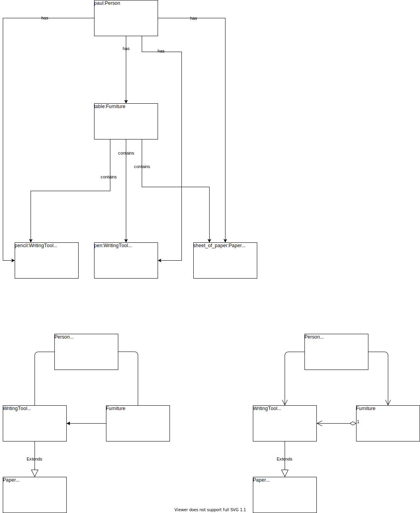

# Lab 03

## Table and Things

&nbsp;

We worked on this exercise together as a team. We started by picking out the nouns in the story. The nouns are:
- table
- a pencil
- a pen
- a sheet of paper
- Paul

For attributes we see that:
- both pencil and pen write in black **color**
- the sheet of paper is not **wrinkled**
- Paul is a person, and has a **name**

For relationships, we can deduce that:
- all of the items listed belongs to Paul
- the pencil, the pen and the sheet of paper is on the table

To derive the class diagrams, we started by finding out what the common objects are, and then assigning a common class to them:
- table => Furniture
- pencil, pen => WritingTool
- sheet of paper => Paper
- Paul => Person

The thinking behind our class diagram is as follows:
- We show an association between Person, WritingTool & Furniture, to show that Person class has a direct relationship with these other classes in terms of ownership.
- We tried to depict that the WritingTool class has a container-contained directional flow with the Furniture class. The Furniture being the container in this case. We were divided on this, as someone else raised that the relationship might be that of composition where the WritingTool class is a part of the Furniture class. We did a diagram to depict that. However, the consensus was that of the directed association.
- Last, but not least, we settle on the Paper class inheriting from the WritingTool class. Looking back now, I think we were going off from "English", as we can classify all as writing materials. Looking at it again, I think Paper should be it's own class. It has no need to inherit attributes or methods from the WritingTools class.
&nbsp;

## Derive Classes from Code
The source code is located at [portfolios/ihar/lab03/bank-application](../portfolios/ihar/lab03/bank-application).

Class diagram before coding:

**Test1** object diagram generated by Fulib:

**Test2** object diagram generated by Fulib:

## Mancala

&nbsp;

**Association between Game System & Player**: The association here shows that a game system can have many players. There's actually a hard limit of two. However, the players can only play on one game at a time.
**Association between Game System & Board**: The association here shows that the system can have exactly one game board, and vice versa.
**Association between Board, Playing Pit & Kalah**: Both the playing pits and the Kalah are a part of the Board. They cannot exist if the board does not exist.
&nbsp;

## ATM Money Withdrawal

A class diagram from the object diagrams created in exercise 2.1.6. with cardinalities is as follows:

- Manually implement this class diagrams in Java (in for example IntelliJ) take special care to achieve bidirectional references and referential integrity (like shown in the lecture). Implement fluent-style access methods for all attributes. 

- Create two tests, creating the two respective different object structures taken from two different object diagrams from exercise 2.1.6 Assign meaningful object names. Take one screenshot each of the fully expanded object-structure (in the debugger) at the end of the tests.

- Extend one of your tests with commands and a respective assert statement to prove that you implemented referential integrity for one to-n-association of your choice correctly. Explain why your test proves this.

- Check in your class src files as well as Tests into your repository with a small readme how to add these to an IntelliJ (or other IDE you chose) project and run the tests.

-The source code is located at [Java Code for ATM](https://gitlab.cs.ut.ee/mickt/systems-modeling-repository/-/tree/main/portfolios/kenny/lab-notes/lab03/ClassesToCode)

