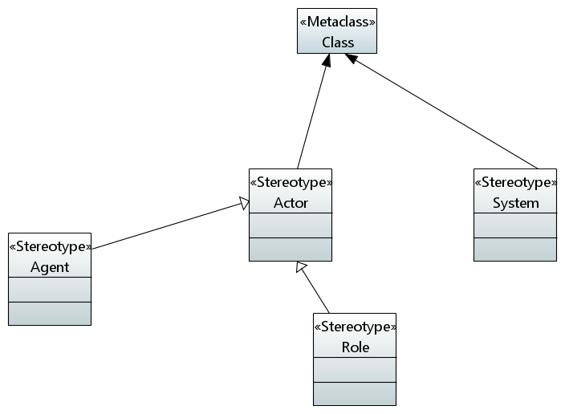
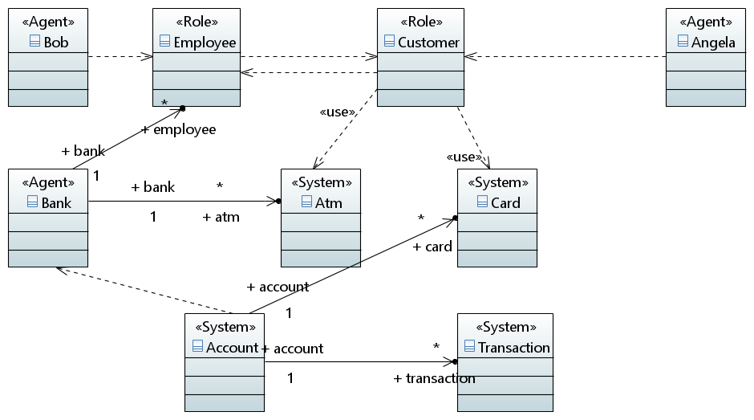

# Lab 05

## ATM Money Withdrawal

We had our initial meeting on Tuesday, however we were not able to achieve anything great on that day because we spent 3/4 the entire session trying to get Papyrus to run. We eventually found a way by installing Eclipse, and adding it as a plugin. The remainder of the session was spent working on the example profile and model given in the slides to get a feel for what we should do. We decided on having another meeting.

We met again on Sunday evening to work on our labs project. Everyone had prepared and we had a really good discussion. Ihar moderated the discussion whilst Monika shared her screen and did the actual modeling.

This is our Profile:      

This is our UML diagram built with our profile:       

For our UML diagram, we picked "User Story 1" for our ATM Money Withdrawal Objet diagram task in [lab 2 - 2.1.6](../lab02/README.md)
