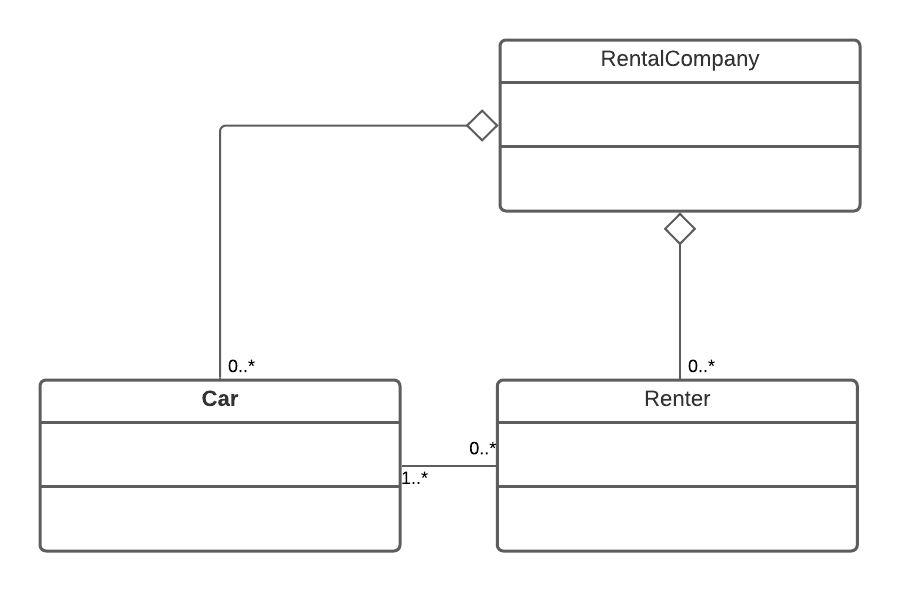
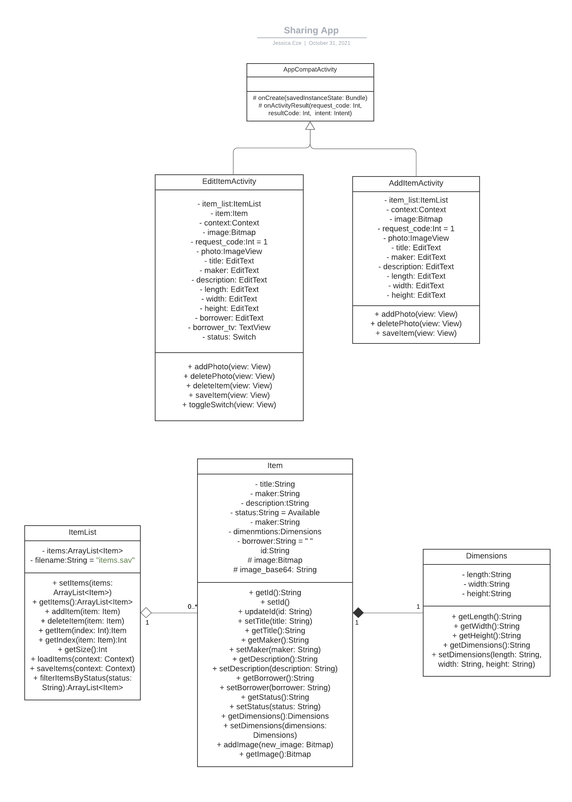

# Object-Oriented Design (Week 2)

In Object-Oriented Modeling, you have different sorts of models or UML diagrams to focus on different software issues, like a structural model, to describe what the objects do and how they relate. It's like having a scale model of a building to understand the spatial relationships.      

The goal of object-oriented design is to make an abstract data type easier to write, structure a system around abstract data types called classes and introduce the ability for an abstract data type to extend another by introducing a concept called inheritance. With an object-oriented programming paradigm, we are now able to build a software system that is made up of entirely abstract data types called classes. Each class defines a type with associated data and functions. These functions are also known as methods. A class acts like a factory, making individual objects, all of a specific type. This allows us to compartmentalize the data and how it can be manipulated in their own separate classes.      
&nbsp;

## Discussion: Design Principles and Language Evolution      
**What software engineering design principles do you think drove the evolution of programming languages?**      
Manage Complexity. Computing became progressively powerful over the years allowing for complex software. Programming languages evolved to take care of these concerns that arose as a result of increased complexity. Some of them are:
- Maintainability: To provide devlopers a simple, efficient way of writing and maintaining the software.
- Correctness: It became necessary to have langauages that provided support for local state which provides some level of confidence in system behaviour. Manipulating global state can have side effects.      
&nbsp;

## Four Design Principles
**Abstraction**           
Abstraction is one of the main ways that humans deal with complexity. Abstraction allows you to better understand a concept by breaking it down into a simplified description that ignores unimportant details. For example, we might want to create an abstraction for a food. In a health context, its nutritional value and not its cost would be part of a simplified description of a food. Good abstraction emphasizes the essentials needed for the concept and removes details that are not essential. Also an abstraction for a concept should make sense for the concept's purpose.      

In object oriented modeling, abstraction pertains most directly to the notion of a class. When you use abstraction to decide the essential characteristics for some concept, it makes the most sense to define all of those details in a class named after the concept. A class is like a template for instances of a concept. An object instantiated from a class then has the essential details to represent an instance of some concept.      

Let's take the concept of a person. What are the essential characteristics of a person that we care about? Well, it's hard to say because person is so vague and we haven't said what the purpose of our person is. The abstractions you create are relative to some context, and there can be different abstractions for one concept. For example, if you are creating a driving app, you would care about a person in the context of a driver. In another example, if you were creating a restaurant app, then you would care about a person in the context of a patron. It is up to you to choose the abstraction that is most appropriate for your purpose.      

In addition to attributes, an abstraction should describe a concept's basic behaviors. For a student, those behaviors would be studying, doing assignments, and attending lectures. These are the responsibilities that the student abstraction does for its purpose. Overall, abstraction is an important principle you use when solving problems and designing your systems. Some of its benefits are simplifying your class design so they are more focused, succinct and understandable to someone else viewing them. As you have learned though, abstractions are formed within a specific context for perspective and you have to carefully decide what is relevant.     
&nbsp; 

**Encapsulation**           
Encapsulation involves three ideas. As the name suggests, it's about making a sort of capsule. The capsule contains something inside, some of which you can access from the outside, and some of which you cannot. 
- First, you bundle attribute values or data, and behaviors or functions, that manipulate those values together into a self-contained object. 
- Second, you can expose certain data and functions of that object, which can be accessed from other objects. 
- Third, you can restrict access to certain data and functions to only within that object.       

In short, encapsulation forms a self-contained object by bundling the data and functions it requires to work, exposes an interface whereby other objects can access and use it, and restricts access to certain inside details. An object's data should only contain what is relevant for that object. For example, A student would only contain relevant data for themselves, like the degree program. This is, as if the student object knows its degree program like a real student would. It would not contain a list of other courses offered, because that is not relevant data for them.      

Encapsulation helps with data integrity. You can define certain attributes and methods of a class to be restricted from outside to access. In practice, you often present outside access to all the attributes, except through specific methods. That way, the attribute values of an object cannot be changed directly through variable assignments. Otherwise, such changes could break some assumption, or dependency for the data within an object.      

Encapsulation can secure sensitive information. For example, you may allow a student class to store a degree program and grade point average, GPA. The student class itself could support queries involving the GPA, without necessarily revealing the actual value of the GPA. For example, the student class could provide a method that tells whether the student is in good standing for the degree program, which uses the GPA and the calculation, but never reveals its actual value.     

Encapsulation helps with software changes. The accessible interface of a class can remain the same, while the implementation of the attributes and methods can change. Outsiders using the class, do not need to care how the implementation actually works behind the interface. In programming, this sort of thinking is commonly referred to as, Black Box Thinking. Think of a class like a black box that you cannot see inside for details about, how attributes are represented, or how methods compute the result, but you provide inputs and obtain outputs by calling methods. It doesn't matter what happens in the box to achieve the expected behaviors. This distinction between what the outside world sees of a class, and how it works internally is important.  

There are three types of relationships found in decomposition, association, aggregation, and composition. They define the interaction between the whole and the parts.
- Association: This is 'some' relationship. This means that there is a loose relationship between two objects. These objects may interact with each other for some time. For example, an object of a class may use services/methods provided by object of another class. Overall, association is a loose partnership between two objects that exist completely independently. They have numbers that are not tied to each other.
- Aggregation: This is a has-a relationship where a whole has parts that belong to it. There may be sharing of parts among the wholes in this relationship. The has-a relationship from the whole to the parts is considered weak. What this means is although parts can belong to the wholes, they can also exist independently.
- Composition: This is an exclusive containment of parts, otherwise known as a strong has-a relationship. What this means is that the whole cannot exist without its parts. If loses any of its parts, the whole ceases to exist. If the whole is destroyed, then all of its parts are destroyed too. Usually, you can only access the parts through its whole. Contained parts are exclusive to the whole.      
&nbsp; 

**Decomposition**           
Decomposition is taking a whole thing and dividing it up into different parts. Or, on the flip side taking a bunch of separate parts with different functionalities, and combining them together to form a whole. Decomposition allows you to further break down problems into pieces that are easier to understand and solve. A general rule for decomposition is to look at the different responsibilities of some whole thing, and evaluate how you can separate them into different parts, each with its own specific responsibility.           

A whole might have a fixed or dynamic number of a certain type of part. If there is a fixed number, then over the lifetime of the whole object it will have exactly that much of the part object. For example, a refrigerator has a fixed number of freezers, just one. This does not change over time, but there are sometimes parts with a dynamic number. Meaning, the whole object may gain new instances of those part objects over its lifetime. For example, a refrigerator can have a dynamic number of shelves or food items over time.     

One issue in decomposition involves the lifetimes of the whole object, and the part objects, and how they could relate. Lifetimes might be closely related. For example, the refrigerator and its freezer have the same lifetime. One cannot exist by itself without the other. If you dispose off the refrigerator, you would dispose off the freezer as well. But lifetime can also not be so related. The refrigerator and food items have different lifetimes. Either can exist independently.      

You can have whole things contain parts that are shared among them at the same time. How can this relationship arise? Consider a person who has a daughter in one family, but also a spouse in another family. The two families are regarded as separate wholes, but they simultaneously share the same part. However, sometimes sharing is not possible or intended. For example, a food item in a refrigerator cannot at the same time also be inside an oven.      

Important issues to understand are how the parts relate to the whole, such as fixed or dynamic number, their lifetimes, and whether there is sharing.      
&nbsp; 

**Generalization**           
Generalization helps us to reduce the amount of redundancy when solving problems. We can model behaviors using methods. It lets us generalize behaviors and it eliminates the need to have identical code written throughout a program. Methods are a way of applying the same behavior to a different set of data. Generalization is frequently used when designing algorithms, which are meant to be used to perform the same action on different sets of data. We can generalize the actions into its own method, and simply pass it through a different set of data through arguments.       

Generalization can be achieved by classes through inheritance. In generalization we take repeated, common, or shared characteristics between two or more classes and factor them out into another class. Specifically, you can have two kinds of classes, a parent class and a child class. You place common attribute and behaviors in your parent class. There can be multiple child classes that inherit from a parent class, and they all will receive these common attributes and behaviors. The child classes can also have additional attributes and behaviors, which allow them to be more specialized in what they can do. In standard terminology, a parent class is known as a superclass and a child class is called the subclass.

Generalizations with Interfaces: In object oriented languages, polymorphism is when two classes have the same description of a behavior, but the implementations of the behavior may be different. This can be seen when we compare a cat and a dog. How would you describe how each of these animals speak? Well, to simply put it, a cat meows and a dog barks. The description of the behavior is the same, both animals can speak. But the actual behavior implementation itself is different. This is known as polymorphism. It is simple to achieve in JAVA using an interface.      
&nbsp; 

## Assignment 1
**"Draw a UML class diagram of an Object-Oriented model for a car rental company that keeps track of cars, renters and renters renting cars"**        
Create a UML class diagram to represent this information. Showing the correct classes and relationships is enough. **Do not** add attributes or methods to the classes.       

## Assignment 2

After you have become familiar with the code, construct a UML class diagram that captures the following six classes and three types of relationships in the code base. For each class, you should document all attributes and methods.      

The six classes are:      
- AppCompatActivity
- AddItemActivity
- EditItemActivity
- ItemList
- Item
- Dimensions

The three types of relationships are:      
- Aggregation
- Composition
- Inheritance
   

