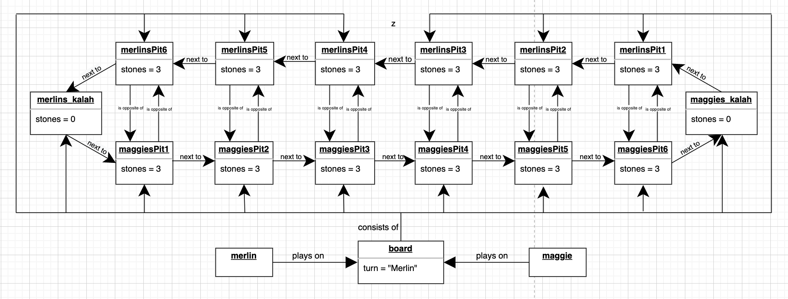
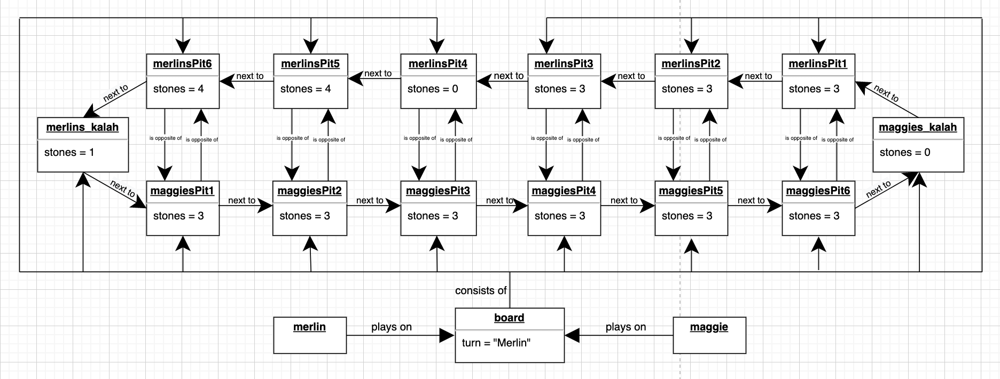
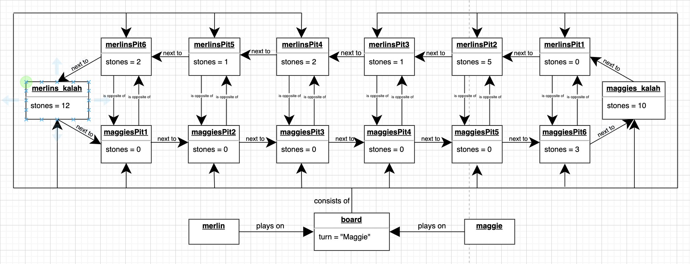
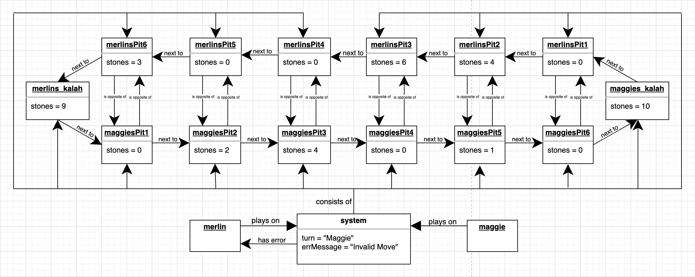
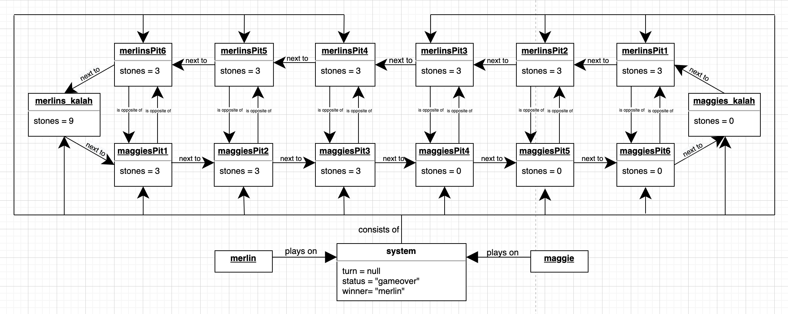
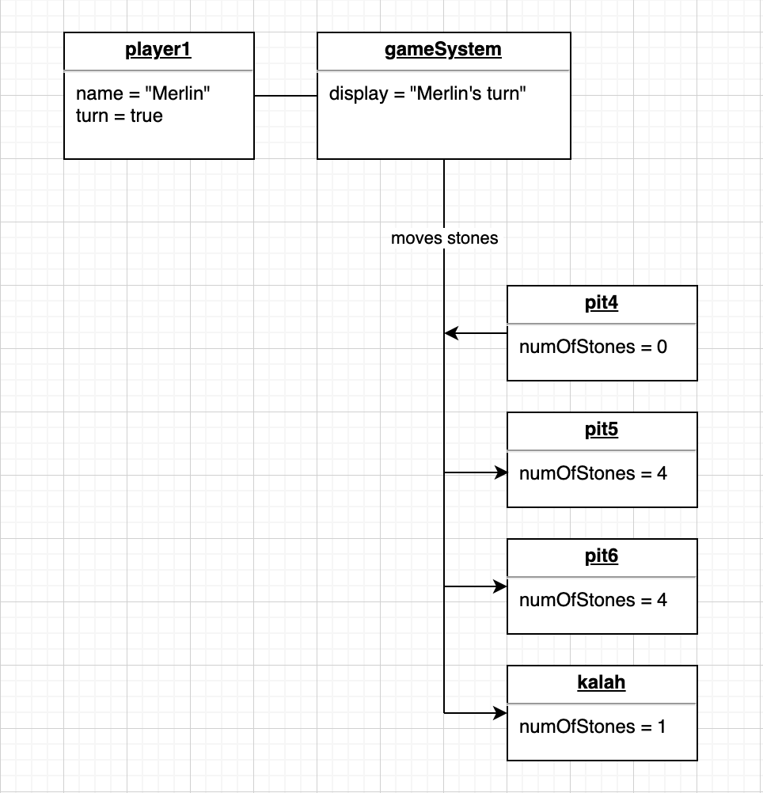
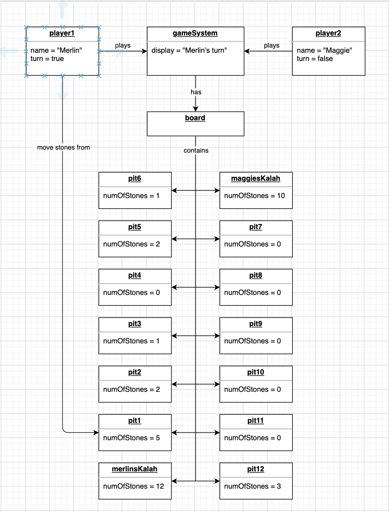
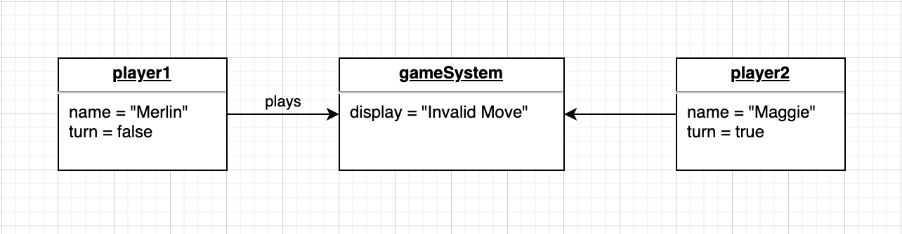

# Lab 02

**Reflections:**       
This was quite an interesting labs. Whilst trying out the exercise, we stumbled on a curiosity (already outlined this in the general labs README file). I got out of labs with a better understanding of object diagrams.

**Contributions:** 
- Moderated the labs call with Ihar
- Added in team reflection for the labs       
&nbsp;

## Lab exercises
### 2.1.3 Object Diagrams for Mancala

**Object Diagram - 1st iteration**        
"Just want to note that I was kinda influenced by the object diagram in Ulno's previous slides, so I did not come up with this on my own". This was the first object diagrams I did. After a discussion in the team, and revising some more, I have come up with new object diagrams.    
 
       
&nbsp;       
The object diagrams in the table below show how each user story differs from the initial state.       
| ID           	| User Story                                                                                                                                                                                                                                                                                                                                                                                                                                                                                                                                                                                                                                                                                                                                                                                                                                                                                                                                                                                                                                                                                                                                                                                                                                                                                                                                                                           	        | Object Diagram                                                                                |
|--------------	|---------------------------------------------------------------------------------------------------------------------------------------------------------------------------------------------------------------------------------------------------------------------------------------------------------------------------------------------------------------------------------------------------------------------------------------------------------------------------------------------------------------------------------------------------------------------------------------------------------------------------------------------------------------------------------------------------------------------------------------------------------------------------------------------------------------------------------------------------------------------------------------------------------------------------------------------------------------------------------------------------------------------------------------------------------------------------------------------------------------------------------------------------------------------------------------------------------------------------------------------------------------------------------------------------------------------------------------------------------------------------------------------- |-----------------------------------------------------------------------------------------------|
| User Story 1 	| **Title: Merlin can get another turn after playing one round** **Precondition** - The Mancala board is placed on the table between Merlin & Maggie. The Mancala board consists of fourteen pits - six playing pits plus one score pit (the kalah) per player. Both Merlin and Maggie have 3 pebbles in each of their playing pits to start the game. 1. Merlin takes the first turn, she picks up all three pebbles from the fourth pit on her side of the board. The fourth pit is now empty. She moves to the right. 2. Merlin drops one pebble into the fifth pit on her side of the board. The fifth pit now has four pebbles, and she has two pebbles left in her hand. She moves to the right. 3. Merlin drops one pebble into the sixth pit on her side of the board. The sixth pit now has four pebbles, and she has one pebble left in her hand. She moves to the right. **Postcondition** - Merlin drops the only pebble left in her hand in her Kalah. She has no pebbles left in her hand. Her Kalah has one pebble in it now. She is eligible to play another round. To play another round, Merlin is allowed to pick from any of the pits that have pebbles in them.                                                                                                                                                                                            	|  	    |
| User Story 2 	| **Title: Merlin stalls to win the game** **Precondition** - All of Merlin's six playing pits have at least one pebble in them. She also has a number of pebbles in her Kalah from the game play. Maggie has 6 pebbles in her fifth pit & 4 pebbles in her sixth pit. She also has a number of pebbles in her kalah from game play. It is Maggie's turn to play. 1. Maggie picks all 6 pebbles in her fifth pit. Moving right, she drops pebbles into each pit she comes across. She gets to her Kalah. She drops one in, but still has 4 pebbles in hand. She continues moving and drops off all the pebble's in Merlin's pits, stopping in the fourth pit. Her turn ends. 2. Merlin purposefully picks up the 4 pebbles from the 1st pit on her side of the board. Moving right, she drops pebbles into each pit she comes across. She drops the last pebble in the fifth pit on her side of the board. 3. Maggie picks up all 4 pebbles from her sixth pit. This is the only pit left with pebbles. She drops one into her Kalah, and continues till she drops all the pebbles in Merlin's pits stopping in the third pit. Her side of the board is now empty. The game ends. **Precondition** - Merlin counts all the pebbles in her Kalah plus the pebbles in the 5 pits on her side of the board. She has more than half of the pebbles on the board. She wins the game. 	|  	    |
| User Story 3 	| **Title: Merlin makes an invalid move which the system rejects** **Precondition** - Merlin has pebbles in 5 playing pits, and 9 pebbles in her kalah. Maggie has pebbles in 3 playing pits only, and 10 pebbles in her kalah. 1. Merlin has just finished a turn. The system recognizes that it is Maggie's turn to play. 2. Merlin clicks her fourth pit to go on another turn after finishing her turn. 3. The system marks the move as invalid and does not distribute the pebbles to the respective pits. **Postcondition** - The system shows an error message to Merlin saying that it is not her turn to play. Maggie can play her turn successfully.                                                                                                                                                                                                                                                                                                                                                                                                                                                                                                                                                                                                                                                                                                                  	|  	|
| User Story 4 	| **Title: The system counts all pebbles to declare the winner** **Precondition** - Merlin has 7 pebbles shared across 5 of her playing pits, and 15 pebbles in her Kalah. Maggie has two pebbles in her fifth & sixth pits, and 14 pebbles in her kalah. It is her turn to play. 1. Maggie picks up the pebble from her fifth pit, and moving right, places it in her sixth pit. Her turn ends. 2. Merlin picks up the pebbles in her 1st pit. They are two in number. Moving right, she drops it in her second and third pit respectively. Her turn ends 3. Maggie picks up the 2 pebbles from her sixth pit. She places one in her kalah, and moving right, places one in Merlin's first pit. Her side of the board is now empty, the game ends. 4. Merlin still has pebbles on her side of the board. The system adds all of them to her kalah. 5. The system redistributes each person's pebbles from their kalah to each of the pits to mirror the new game state. Each pit is filled with three pebbles. **Postcondition** - Merlin's side of the board has been filled with three pebbles each, with 9 leftover in her kalah. This places Merlin as the winner as she has more than half of the pebbles on the board.                                                                                                                                             	|  	    | 
&nbsp; 

**Object Diagram - 2nd iteration**   
During the 4th labs, Ihar commented that the object diagrams I had done did not really change. The way I had understood the task, I just had to change the attributes for it to be a new diagram. He made us understand that we were to show just the parts that changed with the actual objects involved. 
After thinking this through, I decided to try again, this time not influenced by the diagram that Ulno had done. The new diagrams are outlined below.  
 

&nbsp;       
The object diagrams in the table below show how each user story differs from the initial state.       
| ID           	| User Story                                                                                                                                                                                                                                                                                                                                                                                                                                                                                                                                                                                                                                                                                                                                                                                                                                                                                                                                                                                                                                                                                                                                                                                                                                                                                                                                                                           	        | Object Diagram                                                                                        	        |
|--------------	|----------------------------------------------------------------------------------------------------------------------------------------------------------------------------------------------------------------------------------------------------------------------------------------------------------------------------------------------------------------------------------------------------------------------------------------------------------------------------------------------------------------------------------------------------------------------------------------------------------------------------------------------------------------------------------------------------------------------------------------------------------------------------------------------------------------------------------------------------------------------------------------------------------------------------------------------------------------------------------------------------------------------------------------------------------------------------------------------------------------------------------------------------------------------------------------------------------------------------------------------------------------------------------------------------------------------------------------------------------------------------------------------	|-------------------------------------------------------------------------------------------------------------------|
| User Story 1 	| **Title: Merlin can get another turn after playing one round** **Precondition** - The Mancala board is placed on the table between Merlin & Maggie. The Mancala board consists of fourteen pits - six playing pits plus one score pit (the kalah) per player. Both Merlin and Maggie have 3 pebbles in each of their playing pits to start the game. 1. Merlin takes the first turn, she picks up all three pebbles from the fourth pit on her side of the board. The fourth pit is now empty. She moves to the right. 2. Merlin drops one pebble into the fifth pit on her side of the board. The fifth pit now has four pebbles, and she has two pebbles left in her hand. She moves to the right. 3. Merlin drops one pebble into the sixth pit on her side of the board. The sixth pit now has four pebbles, and she has one pebble left in her hand. She moves to the right. **Postcondition** - Merlin drops the only pebble left in her hand in her Kalah. She has no pebbles left in her hand. Her Kalah has one pebble in it now. She is eligible to play another round. To play another round, Merlin is allowed to pick from any of the pits that have pebbles in them.                                                                                                                                                                                            	|  	                    |
| User Story 2 	| **Title: Merlin stalls to win the game** **Precondition** - All of Merlin's six playing pits have at least one pebble in them. She also has a number of pebbles in her Kalah from the game play. Maggie has 6 pebbles in her fifth pit & 4 pebbles in her sixth pit. She also has a number of pebbles in her kalah from game play. It is Maggie's turn to play. 1. Maggie picks all 6 pebbles in her fifth pit. Moving right, she drops pebbles into each pit she comes across. She gets to her Kalah. She drops one in, but still has 4 pebbles in hand. She continues moving and drops off all the pebble's in Merlin's pits, stopping in the fourth pit. Her turn ends. 2. Merlin purposefully picks up the 4 pebbles from the 1st pit on her side of the board. Moving right, she drops pebbles into each pit she comes across. She drops the last pebble in the fifth pit on her side of the board. 3. Maggie picks up all 4 pebbles from her sixth pit. This is the only pit left with pebbles. She drops one into her Kalah, and continues till she drops all the pebbles in Merlin's pits stopping in the third pit. Her side of the board is now empty. The game ends. **Precondition** - Merlin counts all the pebbles in her Kalah plus the pebbles in the 5 pits on her side of the board. She has more than half of the pebbles on the board. She wins the game. 	|  	                    |
| User Story 3 	| **Title: Merlin makes an invalid move which the system rejects** **Precondition** - Merlin has pebbles in 5 playing pits, and 9 pebbles in her kalah. Maggie has pebbles in 3 playing pits only, and 10 pebbles in her kalah. 1. Merlin has just finished a turn. The system recognizes that it is Maggie's turn to play. 2. Merlin clicks her fourth pit to go on another turn after finishing her turn. 3. The system marks the move as invalid and does not distribute the pebbles to the respective pits. **Postcondition** - The system shows an error message to Merlin saying that it is not her turn to play. Maggie can play her turn successfully.                                                                                                                                                                                                                                                                                                                                                                                                                                                                                                                                                                                                                                                                                                                  	|  	                |
| User Story 4 	| **Title: The system counts all pebbles to declare the winner** **Precondition** - Merlin has 7 pebbles shared across 5 of her playing pits, and 15 pebbles in her Kalah. Maggie has two pebbles in her fifth & sixth pits, and 14 pebbles in her kalah. It is her turn to play. 1. Maggie picks up the pebble from her fifth pit, and moving right, places it in her sixth pit. Her turn ends. 2. Merlin picks up the pebbles in her 1st pit. They are two in number. Moving right, she drops it in her second and third pit respectively. Her turn ends 3. Maggie picks up the 2 pebbles from her sixth pit. She places one in her kalah, and moving right, places one in Merlin's first pit. Her side of the board is now empty, the game ends. 4. Merlin still has pebbles on her side of the board. The system adds all of them to her kalah. 5. The system redistributes each person's pebbles from their kalah to each of the pits to mirror the new game state. Each pit is filled with three pebbles. **Postcondition** - Merlin's side of the board has been filled with three pebbles each, with 9 leftover in her kalah. This places Merlin as the winner as she has more than half of the pebbles on the board.                                                                                                                                             	|  	                    | 
&nbsp;      

**Thoughts after revision**   
- Doing the object diagrams again made me realize that there were a lot of things I had not considered in the initial diagram. In the previous one, I was really big on getting the diagrams right. This time around, I tried to capture the relationships. 
- Two of the user stories I had done were a bit subpar. They focused on just the rules of the game instead on a functionality of the system. This was annoying to me when I realized lol.