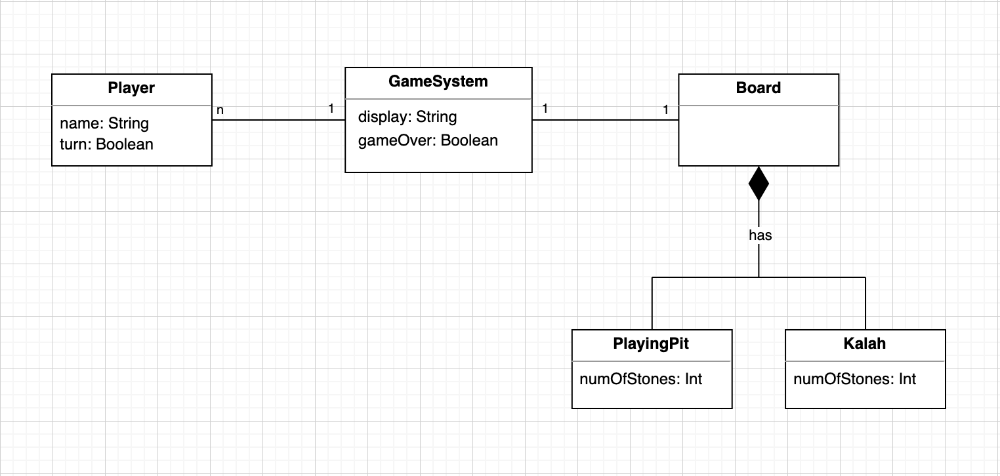

# Lab 03

**Reflections:**       
We worked on table and things during the labs time, and then shared the remaining tasks to everyone. I worked on the class diagram for Mancala. The labs was okay. Would have liked to do the "Derive classes from code" during the lab period, but apart from Ihar, I don't think anyone else had understood enough to contribute including me.   

**Contributions:** 
- Added in team reflection for the labs       
&nbsp;

## Lab exercises
### Mancala

   
&nbsp; 

**Association between Game System & Player**: The association here shows that a game system can have many players. There's actually a hard limit of two. However, the players can only play on one game at a time.      
**Association between Game System & Board**: The association here shows that the system can have exactly one game board, and vice versa.      
**Association between Board, Playing Pit & Kalah**: Both the playing pits and the Kalah are a part of the Board. They cannot exist if the board does not exist.                 
&nbsp;   