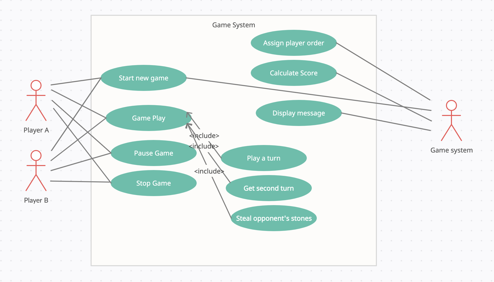

# Lab 06

**Reflections:**       
During this session, the tasks were a bit overwhelming and had to do with code generation which most of us still need not have concrete understanding. We immediately shared the tasks. I had to work on Mancala code generation, use case diagrams and personas with Tahira. We spent the labs reviewing our past work. Some of us, myself included had some questions on the last tasks, and wanted the entire group to review. We had good discussions.

Ishaya came in, and advised that we need to pick up the page because we were lagging behind. He said that the best strategy is to do work on cureent tasks during the labs period. Somthing that has not happened as often as I would like is the instructors dropping by. It almost feels like we're on our own.

## Lab exercises
### Mancala Code Generation   
  
Mancala Class Diagram redone in umple version [here](../../portfolios/jessica/assets/lab04/mancala_class_diagram.ump)      
Mancala Class Diagram redone in fulib version [here](../../portfolios/jessica/code-practice/lab04)

&nbsp;

**Association between Game System & Player**: The association here shows that a game system can have many players. There's actually a hard limit of two. However, the players can only play on one game at a time.      
**Association between Game System & Board**: The association here shows that the system can have exactly one game board, and vice versa.      
**Association between Board, Playing Pit & Kalah**: Both the playing pits and the Kalah are a part of the Board. They cannot exist if the board does not exist.      
&nbsp;     

## Mancala Usecase Diagrams

Name | Diagram
--------|----------------
High-level use case diagram | 

**Discussion**:         
&nbsp;      

## Mancala Personas

Persona | Content Creator
--------|----------------
Photo | 
Fictional name | Tiit Taam
Job title | Board Games Reviewer on Youtube
Demographics | - 23 y.o.  - Estonian  - Engaged  - Has a Bsc in Computer Science
Goals and tasks | Every week, Tiit picks a board game from somewhere around the world, and gives a how-to-play guide to his audience. Based on a recent poll on his twitter account, his audience asks him to review Mancala. Tiit will have to learn the rules of Mancala, and play against experts in order to create a good review for his audience.
Environment | Tiit is a more than average computer user. He is connected to the internet through his building's WIFI. For outages, he uses a mobile hotspot. Tiit uses video editing software to make his videos.
Quote | "Hey guys, welcome to my youtube channel"    

&nbsp;