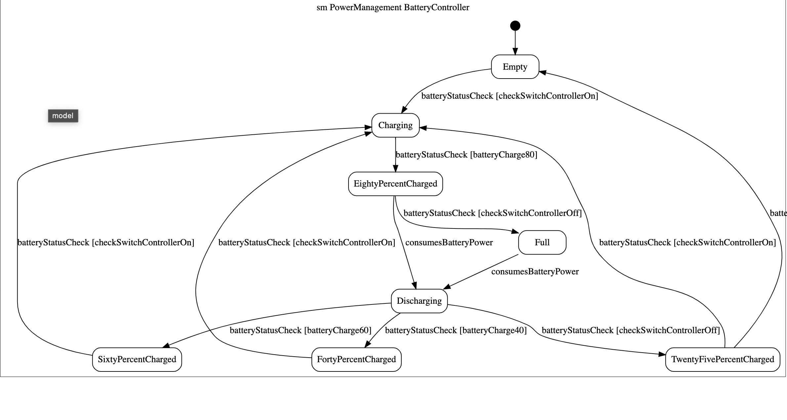
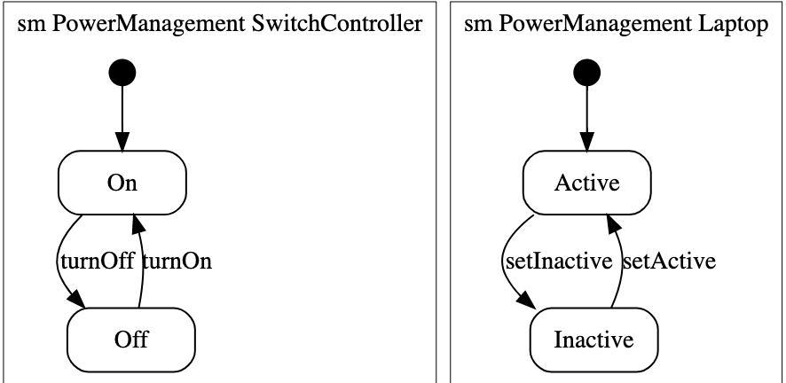

# Lab 09

**Reflections:**       
During this labs, we decided to share the tasks into two parts. I decided to take up task 1 which I have outlined below. I worked on this using Umple. Ran into some issue. So ended up doing a call with Ihar to work through the exercise. I really enjoy collaborating with him.      

## Lab exercises
### Statechart and Model Checking

```java
 
    class PowerManagement {
        Boolean charging=false;
        Boolean isActive=false;
        Boolean isSWitchOn=false;
        
        BatteryController {
            Empty { 
            batteryStatusCheck [checkSwitchControllerOn] -> Charging;
            }
            TwentyFivePercentCharged { 
            batteryStatusCheck [checkSwitchControllerOff] -> Empty;
            batteryStatusCheck [checkSwitchControllerOn] -> Charging;
            }
            FortyPercentCharged { 
            batteryStatusCheck [checkSwitchControllerOn] -> Charging;
            }
            SixtyPercentCharged { 
            batteryStatusCheck [checkSwitchControllerOn] -> Charging;
            }
            EightyPercentCharged { 
            consumesBatteryPower -> Discharging;
            batteryStatusCheck [checkSwitchControllerOff] -> Full;
            }
            Full { 
            consumesBatteryPower -> Discharging;
            }
            Charging {
            batteryStatusCheck [batteryCharge80] -> EightyPercentCharged;
            }
            Discharging {
            batteryStatusCheck [checkSwitchControllerOff] -> TwentyFivePercentCharged;
            batteryStatusCheck [batteryCharge40] -> FortyPercentCharged;
            batteryStatusCheck [batteryCharge60] -> SixtyPercentCharged;
            }
        }
        
        SwitchController {
            On { 
            entry/{turnOn();}
            turnOff -> Off;
            }
            Off { 
            turnOn -> On;
            }
        }
        
        Laptop {
            Active { 
            entry/{setActive();}
            setInactive -> Inactive; 
            }
            Inactive { 
            entry/{setInactive();}
            setActive -> Active; 
            }
        }
        
        void turnOn() {  
            this.isSWitchOn = true;
        }  
        
        void setActive() {  
            this.isActive = true;
        }  
        
        void setInactive() {  
            this.isActive = false;
        }  
    }
```

